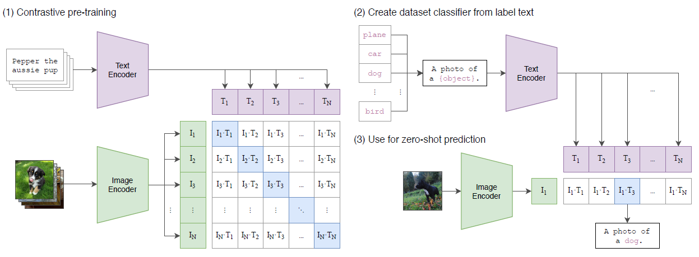
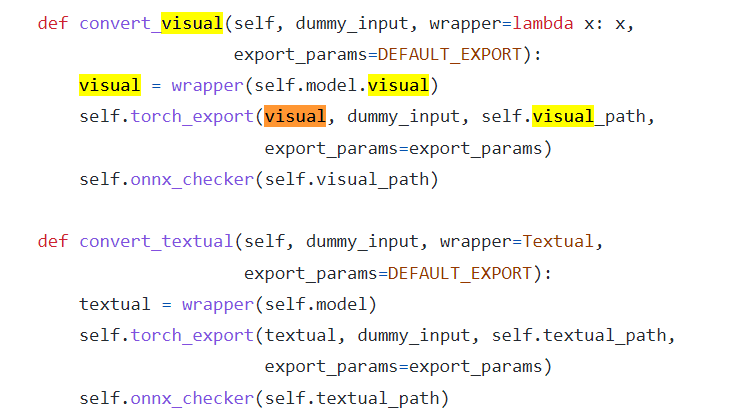

# TRT-Hackathon2022-BIT-jedibobo
This project aims at TensorRT Hackathon2022 Contest(https://tianchi.aliyun.com/competition/entrance/531953/information))

## 原始模型
本小组选择了[CLIP:Contrastive Language-Image Pretraining](https://github.com/openai/CLIP)作为待优化的模型。
### 模型简介
- CLIP模型是OpenAI提出的在图片文本对上训练的模型，利用对比学习的方式完成算法设计，创新点在于将自然语言的抽象概念引入了计算机视觉领域。其本身是一种多模态的[模型](https://paperswithcode.com/methods/category/vision-and-language-pre-trained-models)。
- CLIP适用的下游任务十分广泛，根据论文介绍：其可在OCR、视频动作理解等看似不相关的领域取得很好的性能。
- 其在Zero-shot方面的性能十分强大，在很多数据集上要强于训练后的ResNet50。此外，CLIP还可以通过linear-probe的方式用于物体分类的任务。
- CLIP可以直接被用于视频中物体的检索。
- 模型的结构如下图所示：

CLIP主要由上方的文本编码器(text encoder)和下方的图片编码器(image encoder)组成。也是本项目要通过TensorRT加速的部分。  

训练时（上图(1)），通过对比学习的方法，将文本(text)和对应的图片(image)的正确匹配（矩阵中对角线）作为正样本，将其余配对作为负样本。实现利用文本作为图像的监督信号的“自监督训练”。

在做zero-shot推理时，输入的图片经过图片编码器，文本通过提示（prompt）的方式给文本编码器，然后计算最大匹配关系，得到预测的结果。  

本文也找到了一个CLIP用于视频中检索物体的[例子](https://github.com/johanmodin/clifs)，认为其具有潜在的应用价值。


### 模型优化的难点
&emsp; CLIP模型分为visual和textual两部分，分别对应对输入图片和输入文本的两个模型。而结合clifs视频检索的需求，准备阶段需要截取视频关键帧，并对图像做预处理、编码并保存特征，分批次地多次调用visual模型。而在输入一个查询时，仅用推理一次textual模型。因此首先优化的模型应是占用大量的visual模型。
由于visual部分模型使用ViT-B/32，直接使用polygraphy是可以正常生成模型的，但是会出现以下两个问题；
- 因为层融合导致精度难对齐
- 使用第一阶段的LayerNorm Plugin导致误差在1的量级
textual部分则由一个token-embedding和position-embedding后经过permute，再使用Transformer进行编码，最后以LayerNorm层结束。
## 优化过程
### 步骤分解
&emsp; 模型优化过程主要分为以下几个步骤：
- torch模型的推理和时间计算
- torch的pt模型正确导出到onnx模型
- onnx模型转换为tensorrt engine（中间插入优化手段）
- 比较torch和tensorrt推理输出（结果正确性验证），并测速
### 初步结果
&emsp; 本人单兵作战，有实验室任务的压力，且过多时间花费在了结果正确验证上，导致速度结果不是很令人满意，精度上在fp32上满足了clifs的需求，与torch的结果基本一致。
这一部分是报告的主体。请把自己假定为老师，为TensorRT的初学者讲述如何从原始模型出发，经过一系列开发步骤，得到优化后的TensorRT模型。  

### torch模型推理和时间计算
&emsp; 推理部分主要参考CLIP原工程，时间计算将在和trt对比时说明。需要注意，CLIP原工程中的推理计算部分默认使用了fp16精度来提高推理速度，为了对比精度和速度，需要将本来的实现加入*bool: use_fp16* 的选项。
### torch导出onnx模型
&emsp; 观察CLIP中clip.py中CLIP类的构造，发现是存在两个模型，因此需要分开导出。对于visual模型，其shape中可变的维度在第一维度，即(batch_size, 3, h, w)。对于textual模型，CLIP工程中简化处理，使用一个简单的tokenizer把输入的查询文本变成了shape为(batch_size,77)的张量。
这里参考了一个Github项目[CLIP-ONNX](https://github.com/Lednik7/CLIP-ONNX)，其核心部分如下图所示：
### 

这里在转换时，加载了CLIP的训练权重。
### onnx转tensorrt plan
&emsp;使用常规的onnx-parser代码就可以成功转换，测试用的tensorrt版本为8.4GA。通过registry.cn-hangzhou.aliyuncs.com/trt2022/trt-8.4-ga构建。  

相关的代码文件都在src中。

### trt和torch输出对比和测速
&emsp;“只加速不注重正确性是没有意义的计算”————鲁迅（应该没说过）。

&emsp;CNN的视觉模型要求在fp32下精度为1e-6量级，在fp16下精度为1e-3量级。Transformer的精度要求未知。但从最终结果看，clifs对精度的要求并不是特别高。在1e-4级别的精度已经能和torch输出相同的查询结果（具体原因见search中对相似性(similarity)的计算方法）。
相关脚本，见validate中的test_trt.py文件，该文件比较了推理结果，并使用torch内置的cudaEvent来测量时间。

&emsp;十分建议玮神出一个逐步分析和优化的best practice。
## 精度与加速效果
- 精度结果

&emsp;使用如下函数比较torch和tensorrt输出结果的差别。diff0是最大误差值，diff1是相对误差的中位数。
```python
def check(a, b, weak=False, epsilon=1e-5):
    if weak:
        res = np.all(np.abs(a - b) < epsilon)
    else:
        res = np.all(a == b)
    diff0 = np.max(np.abs(a - b))
    diff1 = np.median(np.abs(a - b) / (np.abs(b) + epsilon))
    print("check:", res, diff0, diff1)
    return res, diff0, diff1
```

在fp32，tf32和fp16精度下的误差分别如下表格所示：
|  精度   | diff0（绝对误差最大值）  | diff1（相对误差中值）
| :----:| :----:|:----:|
| fp32  | 6e-4  | 7e-4 | 
| tf32  | 1e-3  | 7e-4 |
| fp16  | 1e-2  | 9e-3 |

&emsp;除此之外，使用第一阶段的LayerNorm Plugin优化模型，结果误差在1的数量级，
这里的输入是有意义的图片，即CLIP原工程中的CLIP.png图片作为输入，上述精度结果是在batch_size=512下测试得到的。其他batch size下精度的量级并没有发生变化，该batch size适合推理时的大小。

&emsp;**结论如下**：使用fp32和tf32精度下勉强能和torch的输出结果对齐，猜测LayerNorm失败的原因可能是内部计算模式和CLIP并不相同。但由于时间问题未定位到原因。

&emsp;在构建clifs应用时，发现在tf32、fp32与fp16精度下，输出的查询结果都和torch一致，所以clifs对输出精度的要求在1e-2量级都是允许的。这是发现比较神奇的事情。
- 速度结果
计时的方式为使用torch.cuda.Event()
结构为：
```python
start = torch.cuda.Event(enable_timing=True)
end = torch.cuda.Event(enable_timing=True)
start.record()
for i in range(nRound):
    #inference process
    #model(input) 
end.record()    
torch.cuda.synchronize()
image_time_pytorch = start.elapsed_time(end)/nRound
```
在fp32、tf32和fp16精度下，模型在A10 GPU上的推理速度比较表格如下(batch size=1024(Max input in profile))：
|  速度   | torch_time/trt_time  | 加速比
| :----:| :----:|:----:|
| fp32(torch.fp32)  | 668.11/819.22  | 0.8155 | 
| tf32(torch.fp32)  | 668.11/404.00  | 1.6537 |
| fp16(torch.fp32)  | 672.70/211.75  | 3.1768 |
| fp16(torch.fp16)  | 462.39/212.17  | 2.1794 |

在fp32、tf32和fp16精度下，模型在A10 GPU上的推理速度比较表格如下(batch size=768(Opt input in profile))：
|  速度   | torch_time/trt_time  | 加速比
| :----:| :----:|:----:|
| fp32(torch.fp32)  | 526.21/633.82  | 0.8302 | 
| tf32(torch.fp32)  | 523.36/299.35  | 1.7483 |
| fp16(torch.fp32)  | 527.62/163.45  | 3.2281 |
| fp16(torch.fp16)  | 381.02/162.26  | 2.3481 |

在fp32、tf32和fp16精度下，模型在A10 GPU上的推理速度比较表格如下(batch size=64(Min input in profile))：
|  速度   | torch_time/trt_time  | 加速比
| :----:| :----:|:----:|
| fp32(torch.fp32)  | 126.91/53.33  | 2.3798 | 
| tf32(torch.fp32)  | 140.09/28.27  | 4.9549 |
| fp16(torch.fp32)  | 126.39/15.75  | 8.0230 |
| fp16(torch.fp16)  | 106.42/15.81  | 6.7324 |

&emsp;**结论如下**：tensorrt和torch的加速比，在小batch_size下比较明显。不同batch size下，trt.fp32还略慢于Torch.fp32（除小batch size，而原因未定位到）。其余精度的加速比均大于一。


## run test
测试代码为：test_trt.py 修改clip_trt.py中加载的plan模型修改推理时trt的精度，通过load中的use_FP16参数指定Torch的推理精度。
一键启动脚本：包含了测试trt精度和torch对比，以及将trt嵌入clifs搜索框架下的表现。
```shell
sh run_benchmark.sh  
```

## 经验与体会（可选）
第一阶段参赛在玮神的提示下一步步地解决问题，感觉学到了很多。中间也像无头苍蝇一样乱撞了差不多1个星期，最后苟进了决赛。
个人感觉第一二阶段中间间隔有些短，没来得及学习玮神的代码，把trt的用法吃透。第二阶段自定义模型完全是因为个人原因没充分地开发，后续还会对上述问题进一步改进。


## 应用效果

## Todo
- [] 寻找fp32下，trt在大batch size慢于torch的原因
- [] 寻找LayerNorm Plugin误差大的原因
- [] 降低各个精度下的误差
- [] 使用fastertransformer repo优化本工程
